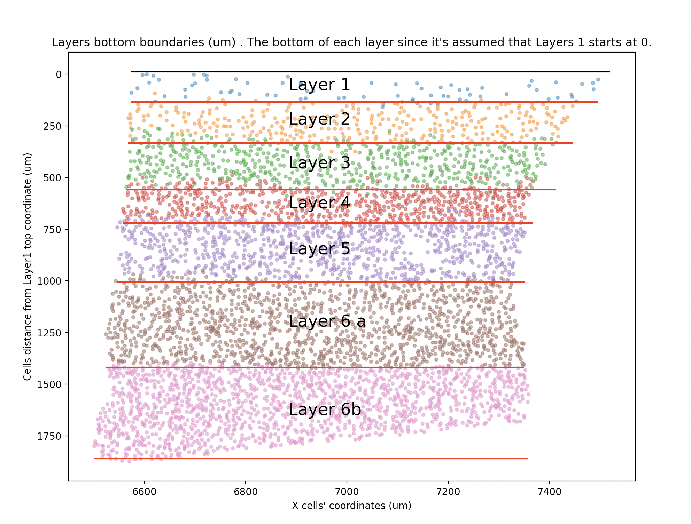
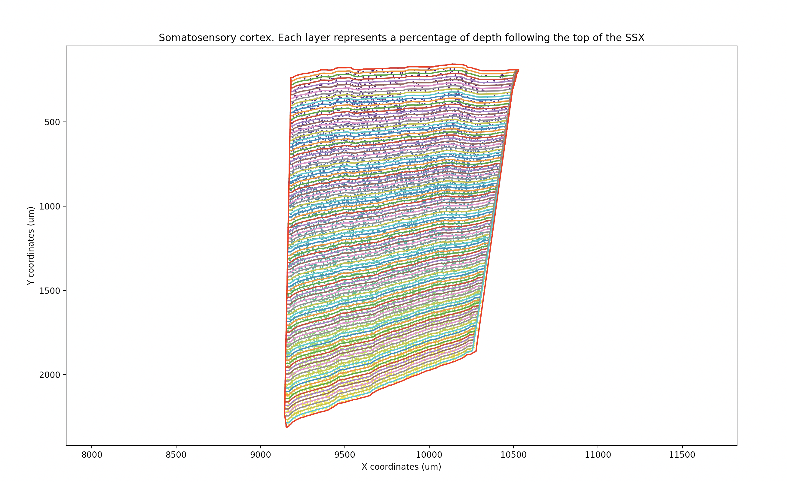
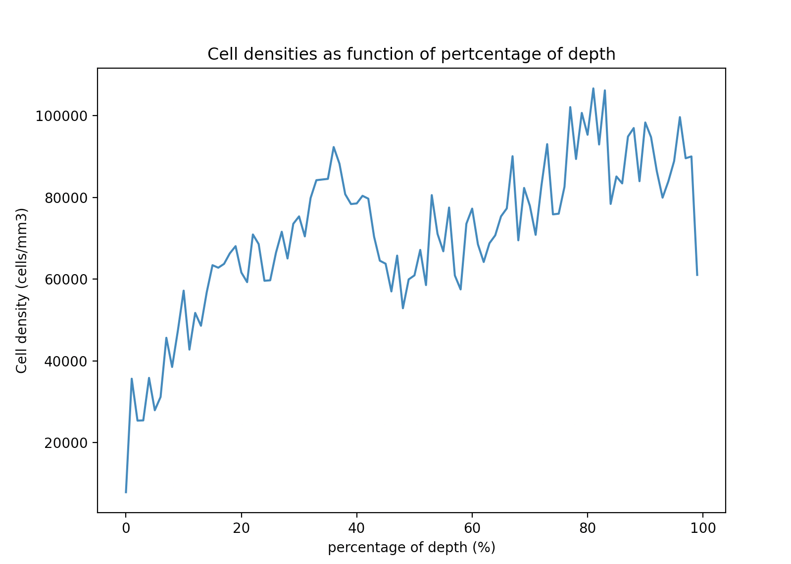

# Processing for rat somatosensory cortex QuPath Nissl data 

## General idea
EPFL LNMC laboratory provides some rat somatosensory cortex Nissl microscopy images.
From these images and some QuPath annotations, this package can generate: 
   - Layers bottom boundaries (um) . The bottom of each layer since it's assumed that Layers 1 starts at 0.



 - cells densities as a function of the percentage of depth inside the somatosensory cortex.
 



# The pipeline consists of two main steps:
1. (groovy + QuPath) Cells detection, export annotations, and cells coordinates
2. (python) Processing for rat somatosensory cortex QuPath Nissl data
 
# Lexicon
The following definitions will stay in effect throughout the code.
-S1HL annotation: S1HL annotation in QuPath that defines the rat somatosensory cortex

# Cells densities processing Steps
- Read input data from QuPath results
- Convert annotations to cartesian point coordinates and shapely polygon.
- Split the S1HL polygon following the S1HL "top and bottom lines" shapes in n polygons (named spitted_polygon)
- Count the number of cells located in each spitted_polygon
- Compute the volume of each spitted_polygon (mm3)
- Compute the cells densities as function of the percentage of the sscx depth
- Export result files

# Layers boundaries processing Steps
- Read input data from QuPath results
- Apply the DBSCAN algorithm on each layer to remove isolated cells ((https://scikit-learn.org/stable/modules/generated/sklearn.cluster.DBSCAN.html))
- Rotate all cells coordinates with angle beetween the top line and x axis
- Locate the boundaries by finding the bottom of each line (average y position of the n lower points)  
- Export the results

## Installation
- QuPath: https://qupath.github.io/
- Python library
```shell
$ git clone ssh://bbpcode.epfl.ch/molecularsystems/qupath_processing
$ cd qupath_processing
$ pip install .

```
### Third parties 
- python third parties libraries are installed during package installation.
see requirements.txt
- QuPath v0.3.0
- QuPath qupath-extension-stardist-0.3.0.jar and qupath-extension-tensorflow-0.3.0.jar extensions

#  Input data
## Input data for groovy script
- QuPath project including the images to process and these 5 annotations: S1HL, top_left, top_right, bottom_left and bottom_right 
- cellpose model used in Cellpose_Export_Detections_Annotations.groovy script to detect cells

## Input data for python single image processing
- The date bellow is generated by the Groovy_scprits/Cellpose_Export_Detections_Annotations.groovy script
- cell position file and metadata (i.e the layer):  created with the groovy saveDetectionMeasurements command
- annotations file:
1. top_left, top_right, bottom_left and bottom_right annotation points
2. S1HL polygon annotation
- pixel size :  a float number that represents the pixel size


# Compute the densities of one image
- modify ./Config/linux/depth.ini with your configuration
- execute the python script
```shell
$ pyqupath_processing density --config-file-path ./Config/linux/density.ini
```

# Compute the densities of several images in batch
- modify ./Config/linux/batch_density.ini with your configuration
- execute the python script
```shell
$ pyqupath_processing density --config-file-path ./Config/linux/batch_density.ini

```

# Compute the layers boundaries of one images
- modify ./Config/linux/boundary.ini with your configuration
- execute the python script
```shell
# pyqupath_processing batch_density --config-file-path ./Config/linux/boundary.ini 
```


